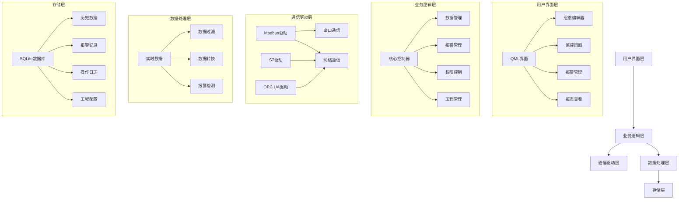
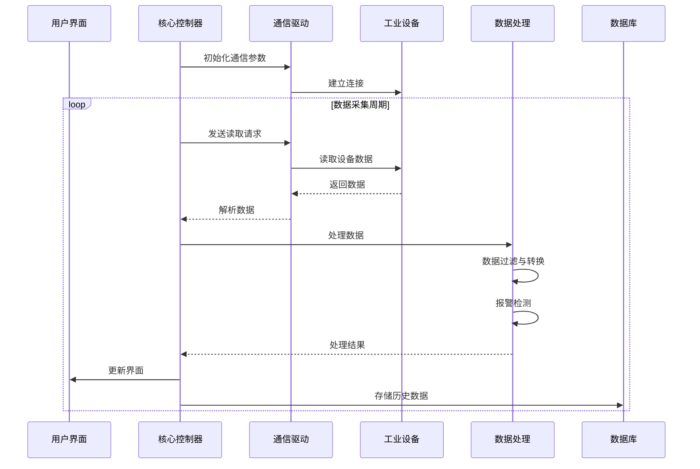

# 基于Qt 6.8 + QML的轻量级工业SCADA系统项目全量文档

## 1. 项目概述

### 1.1 项目定位
本项目旨在开发一款基于Qt 6.8（C++20 + QML）的轻量级工业SCADA系统，专注于中小型工业场景的实时监控与数据采集需求。系统设计理念以"低资源占用、高实时性、嵌入式适配"为核心，为工业设备提供可视化监控、数据采集、报警管理等功能。

### 1.2 项目目标
- 构建轻量级SCADA系统，满足小型工业现场的监控需求
- 支持主流工业通信协议（Modbus、S7、OPC UA）
- 提供直观的可视化组态界面，支持拖拽式开发
- 实现实时数据处理与低延迟响应（≤50ms）
- 支持跨平台部署（Windows、Linux、嵌入式ARM）
- 内存占用控制在100MB以内，适应资源受限环境

### 1.3 对标Fuxa/UIOTOS的差异化优势
| 特性 | 本系统 | Fuxa | UIOTOS |
|------|--------|------|--------|
| 资源占用 | 极低（≤100MB内存） | 中等 | 中等 |
| 启动速度 | 快速（<3秒） | 中等 | 中等 |
| 实时性 | 高（≤50ms延迟） | 中等 | 中等 |
| 嵌入式适配 | 优秀（ARM Cortex-A7以上支持） | 有限 | 有限 |
| 开发语言 | C++20 + QML（性能优异） | Node.js（JavaScript） | Node.js（JavaScript） |
| 跨平台 | 原生支持（Qt框架） | 依赖浏览器 | 依赖浏览器 |
| 部署方式 | 独立应用，无需网络 | 依赖服务器 | 依赖服务器 |

## 2. 功能需求

### 2.1 设备通信模块
#### 2.1.1 Modbus驱动
- **工业场景价值**：广泛应用于工业现场的传感器、执行器、PLC等设备，是工业通信的基础协议
- **技术实现边界**：
  - 支持Modbus RTU（串口）和Modbus TCP（网络）协议
  - 支持设备断线自动重连（默认重试间隔3秒，最大重试次数10次）
  - 支持寄存器映射配置（ coils、discrete inputs、input registers、holding registers）
  - 通信超时设置（默认500ms）
  - 数据采集频率可配置（最小100ms）
  - 使用Qt SerialBus和Qt Network实现

#### 2.1.2 S7驱动
- **工业场景价值**：针对西门子PLC设备的专用通信协议，在工业自动化领域应用广泛
- **技术实现边界**：
  - 支持S7-200、S7-300、S7-400、S7-1200、S7-1500系列PLC
  - 支持基本数据类型（BOOL、BYTE、WORD、DWORD、INT、DINT、REAL）
  - 通信超时设置（默认800ms）
  - 断线重连机制（同Modbus）
  - 使用libnodave或自定义实现

#### 2.1.3 OPC UA驱动
- **工业场景价值**：工业4.0时代的标准通信协议，支持复杂数据结构和安全通信
- **技术实现边界**：
  - 支持OPC UA TCP协议
  - 支持基本安全策略（None、Basic256Sha256）
  - 支持数据订阅机制
  - 通信超时设置（默认1000ms）
  - 断线重连机制（同Modbus）
  - 使用Qt OPC UA模块实现

### 2.2 可视化组态模块
- **工业场景价值**：为操作人员提供直观的工艺流程监控界面，降低操作复杂度
- **技术实现边界**：
  - 基于QML的拖拽式组态编辑器
  - 支持常用工业元件库（按钮、指示灯、仪表盘、趋势图、表格等）
  - 支持矢量图形导入（SVG格式）
  - 支持画面缩放、平移操作
  - 支持多层级画面管理
  - 支持变量绑定与动画效果
  - 响应式布局，适配不同分辨率屏幕

### 2.3 实时数据处理模块
- **工业场景价值**：确保数据采集的实时性和准确性，为监控决策提供基础
- **技术实现边界**：
  - 基于Qt的事件循环和信号槽机制
  - 数据采集线程与UI线程分离
  - 支持数据过滤与平滑处理
  - 数据更新频率可配置（最小100ms）
  - 内存数据缓存（默认缓存最近1000条记录）
  - 支持数据类型转换与单位换算

### 2.4 报警与事件模块
- **工业场景价值**：及时发现并处理工业现场的异常情况，保障生产安全
- **技术实现边界**：
  - 支持模拟量报警（高限、低限、高高限、低低限）
  - 支持开关量报警（状态变化）
  - 报警优先级设置（低、中、高、紧急）
  - 报警确认与处理流程
  - 报警历史记录
  - 报警声音与视觉提示
  - 支持报警规则配置

### 2.5 历史数据与报表模块
- **工业场景价值**：用于数据分析、故障追溯和生产管理
- **技术实现边界**：
  - 基于SQLite轻量级数据库存储
  - 支持数据定时存储（最小间隔1秒）
  - 支持数据压缩存储策略
  - 支持历史数据查询与趋势显示
  - 支持报表生成（CSV格式）
  - 支持数据导出功能

### 2.6 权限管理模块
- **工业场景价值**：保障系统安全，防止误操作和未授权访问
- **技术实现边界**：
  - 基于角色的权限控制（管理员、工程师、操作员、查看员）
  - 支持用户登录与密码验证
  - 操作权限精细化控制（如修改参数、确认报警等）
  - 操作日志记录

### 2.7 工程部署模块
- **工业场景价值**：简化系统部署与维护流程，提高工程效率
- **技术实现边界**：
  - 工程文件打包与导入导出
  - 支持离线部署（无需网络连接）
  - 支持工程版本管理
  - 系统配置参数化（如通信参数、数据采集频率等）
  - 支持自动启动与系统服务配置

## 3. 技术路线

### 3.1 整体分层架构

### 3.2 核心模块交互流程

#### 3.2.1 数据采集与处理流程

### 3.3 关键技术选型

| 技术组件 | Qt模块 | 应用场景 | 优势 |
|---------|--------|----------|------|
| 通信协议 | Qt SerialBus | Modbus RTU通信 | 原生支持串口通信，性能优异 |
|         | Qt Network | Modbus TCP/S7/OPC UA网络通信 | 跨平台网络支持，稳定可靠 |
|         | Qt OPC UA | OPC UA协议支持 | 原生支持OPC UA标准 |
| 界面开发 | Qt Quick | 可视化组态界面 | 流畅的动画效果，拖拽式开发 |
|         | Qt QML | UI组件开发 | 声明式语法，开发效率高 |
| 数据存储 | Qt SQL + SQLite | 历史数据与配置存储 | 轻量级，无需额外依赖 |
| 并发处理 | Qt Concurrent | 多线程数据采集 | 简化线程管理，提高性能 |
| 事件处理 | Qt Event Loop | 异步事件处理 | 高效的事件分发机制 |
| 系统集成 | Qt Core | 核心功能实现 | 跨平台支持，性能优异 |
| 图形渲染 | Qt Charts | 趋势图显示 | 专业的图表库，支持实时数据 |

### 3.4 开发/测试/部署规范

#### 3.4.1 开发规范
- 代码风格：遵循Qt编码规范，使用C++20特性
- 命名规范：类名使用驼峰命名法，函数名使用小写加下划线
- 模块划分：按功能模块化设计，接口清晰
- 文档规范：关键代码需添加注释，模块接口需有详细文档
- 版本控制：使用Git进行代码管理，遵循分支开发规范

#### 3.4.2 测试规范
- 单元测试：使用Qt Test框架进行核心模块单元测试
- 集成测试：验证模块间交互的正确性
- 性能测试：测量系统响应时间、内存占用等指标
- 稳定性测试：长时间运行测试，验证系统稳定性
- 兼容性测试：在不同平台上验证系统功能

#### 3.4.3 部署规范
- 打包方式：使用Qt Installer Framework制作安装包
- 依赖管理：静态链接Qt库，减少外部依赖
- 配置管理：使用配置文件存储系统参数
- 升级策略：支持增量升级，保留用户配置
- 日志管理：系统运行日志，便于故障排查

## 4. 非功能需求

### 4.1 性能需求
- **响应时间**：数据采集到界面更新延迟≤50ms
- **内存占用**：系统运行时内存占用≤100MB
- **CPU占用**：空闲时≤5%，满负载时≤30%
- **启动时间**：系统启动时间<3秒
- **数据采集频率**：最小支持100ms/次

### 4.2 兼容性需求
- **操作系统**：支持Windows 10/11、Linux（Ubuntu 20.04+）、嵌入式Linux
- **硬件平台**：支持x86/x64架构，ARM Cortex-A7以上架构
- **分辨率**：支持1024x768及以上分辨率
- **通信接口**：支持RS-232/485串口，以太网接口

### 4.3 安全性需求
- **权限控制**：基于角色的访问控制
- **数据安全**：本地存储数据加密
- **通信安全**：支持OPC UA加密通信
- **操作日志**：记录关键操作，便于追溯

### 4.4 易用性需求
- **界面设计**：简洁直观，符合工业操作习惯
- **组态工具**：拖拽式操作，所见即所得
- **操作流程**：简化常用操作步骤
- **错误提示**：清晰明确的错误信息
- **帮助文档**：完整的用户手册

## 5. 项目计划

### 5.1 阶段划分

| 阶段 | 时间 | 主要任务 |
|------|------|----------|
| 需求分析与设计 | 2周 | 需求细化、架构设计、技术选型 |
| 核心框架开发 | 4周 | 通信驱动、数据处理、存储模块开发 |
| 功能模块开发 | 6周 | 可视化组态、报警管理、报表模块开发 |
| 系统集成与测试 | 4周 | 模块集成、性能测试、兼容性测试 |
| 文档编写与优化 | 2周 | 用户手册、技术文档编写，系统优化 |
| 部署与交付 | 2周 | 安装包制作、部署测试、用户培训 |

### 5.2 里程碑

| 里程碑 | 完成标准 |
|--------|----------|
| 框架搭建完成 | 通信驱动、数据处理、存储模块功能验证通过 |
| 功能模块完成 | 所有功能模块开发完成，基本功能可用 |
| 系统集成完成 | 各模块集成测试通过，系统运行稳定 |
| 性能优化完成 | 性能指标达到要求，内存占用≤100MB，延迟≤50ms |
| 产品交付 | 安装包制作完成，文档齐全，用户培训完成 |

## 6. 验收标准

### 6.1 功能验收
- **设备通信**：成功连接并采集Modbus、S7、OPC UA设备数据
- **可视化组态**：完成至少10个常用工业元件的组态与动画
- **实时数据**：数据更新延迟≤50ms，数据准确性100%
- **报警管理**：正确检测并处理各类报警，报警响应时间≤1秒
- **历史数据**：成功存储和查询历史数据，支持报表导出
- **权限管理**：不同角色权限控制有效，操作日志记录完整
- **工程部署**：工程文件导入导出正常，离线部署成功

### 6.2 性能验收
- **内存占用**：系统运行时内存占用≤100MB
- **CPU占用**：空闲时≤5%，满负载时≤30%
- **启动时间**：系统启动时间<3秒
- **稳定性**：72小时连续运行无故障
- **响应时间**：界面操作响应时间≤200ms

### 6.3 文档验收
- **项目文档**：完整的项目规格书、技术方案
- **用户手册**：详细的操作指南、常见问题解答
- **技术文档**：架构设计、API文档、部署指南
- **测试文档**：测试用例、测试报告

## 7. 风险评估

### 7.1 技术风险
- **通信协议兼容性**：不同设备厂商的协议实现可能存在差异
- **实时性挑战**：在资源受限设备上保证低延迟数据处理
- **跨平台适配**：不同操作系统和硬件平台的适配工作

### 7.2 应对策略
- **协议测试**：针对主流设备厂商的产品进行兼容性测试
- **性能优化**：采用多线程、内存池等技术优化性能
- **模块化设计**：核心功能与平台相关代码分离，便于适配

## 8. 结论与建议

本项目基于Qt 6.8（C++20 + QML）开发轻量级工业SCADA系统，具有资源占用低、实时性高、嵌入式适配性强等优势。系统设计充分考虑了中小型工业场景的需求，提供了完整的设备通信、可视化监控、数据处理、报警管理等功能。

建议在开发过程中注重以下几点：
1. 优先保证核心功能的稳定性和实时性
2. 加强与实际工业设备的兼容性测试
3. 注重用户界面的易用性和工业操作习惯的适配
4. 建立完善的测试体系，确保系统质量
5. 持续优化性能，适应资源受限的嵌入式环境

通过本项目的实施，有望为中小型工业企业提供一款性价比高、易于部署和维护的轻量级SCADA解决方案，助力工业数字化转型。