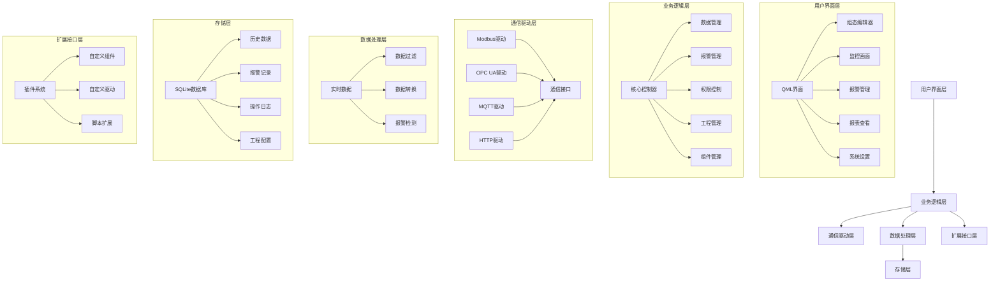
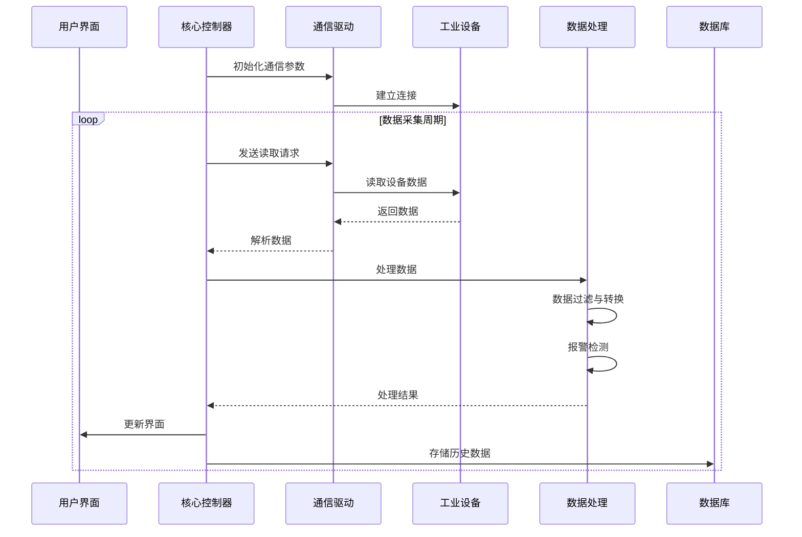
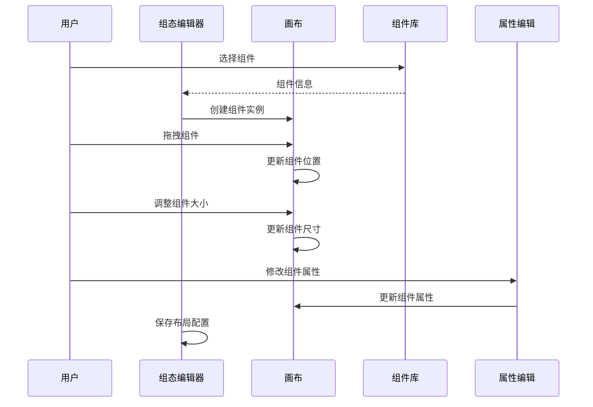

# 华颜工业SCADA系统设计文档

## 1. 项目概述

### 1.1 项目定位
本项目旨在开发一款基于Qt 6.8（C++20 + QML）的工业级SCADA系统，专注于为用户提供基础组件库和常用功能，支持用户根据业务场景设计构建交互界面，并通过多种协议与后台数据交互。系统设计理念以"灵活配置、易于扩展、稳定可靠"为核心，为工业设备提供可视化监控、数据采集、报警管理等功能。

### 1.2 项目目标
- 构建功能完备的SCADA系统，满足工业现场的监控需求
- 支持多种工业通信协议（Modbus、OPC UA、MQTT、HTTP等）
- 提供直观的可视化组态界面，支持拖拽式开发和在线布局修改
- 实现实时数据处理与低延迟响应（≤50ms）
- 支持跨平台部署（Windows、Linux）
- 提供完整的二次开发支持，便于用户扩展功能

### 1.3 核心价值
| 特性 | 描述 | 商业价值 |
|------|------|----------|
| 基础组件库 | 提供丰富的工业组件，支持拖拽式布局 | 降低开发成本，提高工程效率 |
| 多协议支持 | 支持多种工业通信协议 | 适配不同设备，提高系统兼容性 |
| 在线布局修改 | 支持实时调整界面布局 | 快速响应业务需求变化 |
| 二次开发支持 | 模块化架构，支持插件扩展 | 满足个性化需求，延长产品生命周期 |
| 实时数据处理 | 低延迟数据采集与处理 | 确保监控系统的实时性和可靠性 |

## 2. 功能需求

### 2.1 设备通信模块
#### 2.1.1 Modbus驱动
- **工业场景价值**：广泛应用于工业现场的传感器、执行器、PLC等设备，是工业通信的基础协议
- **技术实现边界**：
  - 支持Modbus RTU（串口）和Modbus TCP（网络）协议
  - 支持设备断线自动重连（默认重试间隔3秒，最大重试次数10次）
  - 支持寄存器映射配置（ coils、discrete inputs、input registers、holding registers）
  - 通信超时设置（默认500ms）
  - 数据采集频率可配置（最小100ms）
  - 使用Qt SerialBus和Qt Network实现

#### 2.1.2 OPC UA驱动
- **工业场景价值**：工业4.0标准协议，支持更复杂的数据结构和安全通信
- **技术实现边界**：
  - 支持OPC UA TCP协议
  - 支持基本安全策略（None、Basic256Sha256）
  - 支持数据订阅机制
  - 通信超时设置（默认1000ms）
  - 断线重连机制（同Modbus）
  - 使用Qt OPC UA模块实现

#### 2.1.3 MQTT驱动
- **工业场景价值**：物联网通信协议，支持轻量级设备和云端集成
- **技术实现边界**：
  - 支持MQTT v3.1.1和v5.0协议
  - 支持QoS 0/1/2消息质量等级
  - 支持TLS加密通信
  - 支持主题订阅和发布
  - 断线重连机制（同Modbus）

#### 2.1.4 HTTP/REST驱动
- **工业场景价值**：与现代IT系统集成，支持Web API调用
- **技术实现边界**：
  - 支持HTTP/HTTPS协议
  - 支持GET、POST、PUT、DELETE等方法
  - 支持JSON和XML数据格式
  - 支持基本认证和Bearer Token认证
  - 通信超时设置（默认2000ms）

### 2.2 可视化组态模块
- **工业场景价值**：为操作人员提供直观的工艺流程监控界面，降低操作复杂度
- **技术实现边界**：
  - 基于QML的拖拽式组态编辑器
  - 支持常用工业元件库（按钮、指示灯、仪表盘、趋势图、表格等）
  - 支持矢量图形导入（SVG格式）
  - 支持画面缩放、平移操作
  - 支持多层级画面管理
  - 支持变量绑定与动画效果
  - 响应式布局，适配不同分辨率屏幕
  - 支持在线布局修改和实时预览

### 2.3 实时数据处理模块
- **工业场景价值**：确保数据采集的实时性和准确性，为监控决策提供基础
- **技术实现边界**：
  - 基于Qt的事件循环和信号槽机制
  - 数据采集线程与UI线程分离
  - 支持数据过滤与平滑处理
  - 数据更新频率可配置（最小100ms）
  - 内存数据缓存（默认缓存最近1000条记录）
  - 支持数据类型转换与单位换算

### 2.4 报警与事件模块
- **工业场景价值**：及时发现并处理工业现场的异常情况，保障生产安全
- **技术实现边界**：
  - 支持模拟量报警（高限、低限、高高限、低低限）
  - 支持开关量报警（状态变化）
  - 报警优先级设置（低、中、高、紧急）
  - 报警确认与处理流程
  - 报警历史记录
  - 报警声音与视觉提示
  - 支持报警规则配置
  - 支持报警通知（邮件、短信等）

### 2.5 历史数据与报表模块
- **工业场景价值**：用于数据分析、故障追溯和生产管理
- **技术实现边界**：
  - 基于SQLite轻量级数据库存储
  - 支持数据定时存储（最小间隔1秒）
  - 支持数据压缩存储策略
  - 支持历史数据查询与趋势显示
  - 支持报表生成（CSV、Excel格式）
  - 支持数据导出功能

### 2.6 权限管理模块
- **工业场景价值**：保障系统安全，防止误操作和未授权访问
- **技术实现边界**：
  - 基于角色的权限控制（管理员、工程师、操作员、查看员）
  - 支持用户登录与密码验证
  - 操作权限精细化控制（如修改参数、确认报警等）
  - 操作日志记录

### 2.7 工程部署模块
- **工业场景价值**：简化系统部署与维护流程，提高工程效率
- **技术实现边界**：
  - 工程文件打包与导入导出
  - 支持离线部署（无需网络连接）
  - 支持工程版本管理
  - 系统配置参数化（如通信参数、数据采集频率等）
  - 支持自动启动与系统服务配置

### 2.8 二次开发支持模块
- **工业场景价值**：满足用户个性化需求，延长产品生命周期
- **技术实现边界**：
  - 模块化架构，支持插件扩展
  - QML组件动态加载
  - 提供API接口文档
  - 支持自定义通信驱动
  - 支持脚本扩展（如Python、Lua）

## 3. 技术架构

### 3.1 整体分层架构



### 3.2 核心模块交互流程

#### 3.2.1 数据采集与处理流程



#### 3.2.2 组态编辑流程



### 3.3 技术栈选择

| 技术组件 | 版本/框架 | 应用场景 | 优势 |
|---------|----------|----------|------|
| 开发语言 | C++20 | 核心功能实现 | 性能优异，适合实时系统 |
| 界面框架 | QML 6.8 | 用户界面和组态编辑 | 声明式语法，开发效率高 |
| 通信库 | Qt SerialBus | Modbus通信 | 原生支持，稳定可靠 |
| 网络库 | Qt Network | 网络通信 | 跨平台支持，功能丰富 |
| 数据库 | SQLite | 数据存储 | 轻量级，无需额外依赖 |
| 图表库 | Qt Charts | 数据可视化 | 专业的图表功能 |
| 构建工具 | CMake | 项目构建 | 跨平台支持，配置灵活 |

### 3.4 核心模块设计

#### 3.4.1 通信驱动模块
- **设计原则**：采用插件架构，支持动态加载不同驱动
- **核心类**：
  - `DriverBase`：驱动基类，定义通用接口
  - `ModbusDriver`：Modbus协议实现
  - `OpcUaDriver`：OPC UA协议实现
  - `MqttDriver`：MQTT协议实现
  - `HttpDriver`：HTTP协议实现
- **关键功能**：
  - 连接管理（建立、断开、重连）
  - 数据读写（同步/异步）
  - 错误处理与异常检测

#### 3.4.2 数据处理模块
- **设计原则**：采用事件驱动架构，确保数据处理的实时性
- **核心类**：
  - `DataProcessor`：数据处理核心
  - `TagManager`：标签管理
  - `AlarmManager`：报警管理
- **关键功能**：
  - 数据采集与更新
  - 标签值管理
  - 报警检测与处理
  - 数据缓存与同步

#### 3.4.3 组态编辑模块
- **设计原则**：采用拖拽式架构，提供直观的编辑体验
- **核心组件**：
  - `DragAndDropHelper`：拖拽功能实现
  - `ComponentLibrary`：组件库管理
  - `PropertyEditor`：属性编辑器
- **关键功能**：
  - 组件拖拽与放置
  - 组件属性编辑
  - 布局保存与加载
  - 实时预览

#### 3.4.4 扩展接口模块
- **设计原则**：采用插件架构，支持用户扩展
- **核心类**：
  - `PluginManager`：插件管理
  - `ComponentInterface`：组件接口
  - `DriverInterface`：驱动接口
- **关键功能**：
  - 插件加载与管理
  - 接口注册与调用
  - 扩展点管理

## 4. 二次开发支持

### 4.1 组件开发
- **开发流程**：
  1. 创建QML组件文件
  2. 实现组件逻辑和属性
  3. 注册到组件库
  4. 测试与部署
- **示例**：
  ```qml
  // 自定义组件示例
  import QtQuick 2.15
  
  Rectangle {
      id: customComponent
      width: 100
      height: 100
      color: "#3498DB"
      
      property string tagName: ""
      property variant value: 0
      
      Text {
          anchors.centerIn: parent
          text: value
          color: "white"
          font.bold: true
      }
  }
  ```

### 4.2 驱动开发
- **开发流程**：
  1. 继承DriverBase类
  2. 实现通信逻辑
  3. 注册驱动类型
  4. 测试与部署
- **示例**：
  ```cpp
  // 自定义驱动示例
  class CustomDriver : public DriverBase {
  public:
      CustomDriver(QObject *parent = nullptr);
      
      bool connect() override;
      void disconnect() override;
      QVariant read(const QString &address) override;
      bool write(const QString &address, const QVariant &value) override;
  };
  ```

### 4.3 脚本扩展
- **支持方式**：
  - 集成脚本引擎（如Python、Lua）
  - 提供API接口
  - 支持事件触发脚本
- **应用场景**：
  - 复杂逻辑处理
  - 自定义报警规则
  - 数据转换与处理

## 5. 部署与维护

### 5.1 部署方式
- **Windows**：
  - 安装包部署
  - 绿色版部署
  - 系统服务部署
- **Linux**：
  - 安装包部署
  - 包管理器部署（如deb、rpm）
  - 系统服务部署

### 5.2 配置管理
- **配置文件**：
  - 系统配置（通信参数、采集频率等）
  - 工程配置（界面布局、组件属性等）
  - 用户配置（权限、偏好设置等）
- **配置格式**：
  - JSON格式
  -  XML格式

### 5.3 升级与维护
- **升级策略**：
  - 增量升级
  - 完整升级
  - 配置保留
- **维护工具**：
  - 日志查看器
  - 通信诊断工具
  - 数据库管理工具

## 6. 性能与安全

### 6.1 性能指标
- **响应时间**：数据采集到界面更新延迟≤50ms
- **内存占用**：系统运行时内存占用≤200MB
- **CPU占用**：空闲时≤10%，满负载时≤40%
- **启动时间**：系统启动时间<5秒
- **数据采集频率**：最小支持100ms/次

### 6.2 安全措施
- **权限控制**：基于角色的访问控制
- **数据安全**：本地存储数据加密
- **通信安全**：支持OPC UA、MQTT等加密通信
- **操作审计**：记录关键操作，便于追溯
- **防误操作**：关键操作确认机制

## 7. 项目实施

### 7.1 实施步骤
1. **需求分析**：了解用户需求，确定系统功能
2. **架构设计**：设计系统架构，确定技术方案
3. **核心开发**：开发核心功能模块
4. **组件开发**：开发工业组件库
5. **系统集成**：集成各功能模块
6. **测试验证**：进行功能测试和性能测试
7. **部署实施**：部署系统到现场
8. **培训支持**：提供用户培训和技术支持

### 7.2 项目计划

| 阶段 | 时间 | 主要任务 |
|------|------|----------|
| 需求分析与设计 | 2周 | 需求细化、架构设计、技术选型 |
| 核心框架开发 | 4周 | 通信驱动、数据处理、存储模块开发 |
| 功能模块开发 | 6周 | 可视化组态、报警管理、报表模块开发 |
| 扩展接口开发 | 3周 | 插件系统、二次开发接口开发 |
| 系统集成与测试 | 4周 | 模块集成、性能测试、兼容性测试 |
| 文档编写与优化 | 2周 | 用户手册、技术文档编写，系统优化 |
| 部署与交付 | 2周 | 安装包制作、部署测试、用户培训 |

## 8. 结论与建议

本项目基于Qt 6.8（C++20 + QML）开发工业级SCADA系统，具有以下优势：

1. **灵活的组态功能**：支持拖拽式布局和在线修改，满足不同业务场景的需求
2. **多协议支持**：适配不同设备，提高系统兼容性
3. **完整的二次开发支持**：便于用户扩展功能，满足个性化需求
4. **实时数据处理**：低延迟数据采集与处理，确保监控系统的可靠性
5. **专业的工业界面**：符合工业操作习惯，提高操作效率

建议在实施过程中注重以下几点：

1. **优先保证核心功能的稳定性和实时性**
2. **加强与实际工业设备的兼容性测试**
3. **注重用户界面的易用性和工业操作习惯的适配**
4. **建立完善的测试体系，确保系统质量**
5. **提供详细的二次开发文档，降低用户扩展难度**

通过本项目的实施，有望为工业企业提供一款功能完备、易于扩展、稳定可靠的SCADA解决方案，助力工业数字化转型。